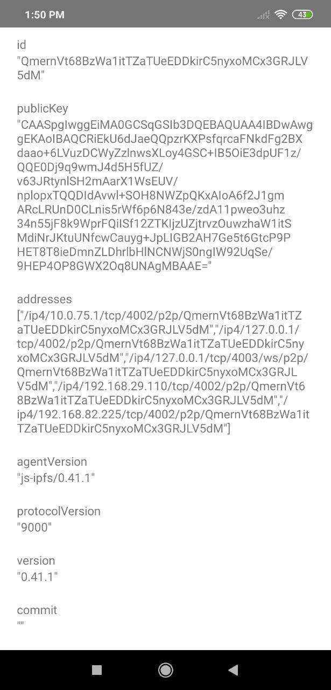

# `rn-nodeify`

Using `rn-nodeify` with an ejected, vanilla React Native app in order to use the native dep of [`react-native-randombytes`](https://github.com/mvayngrib/react-native-randombytes#readme) which is needed as a peer dep of [`react-native-crypto`](https://github.com/tradle/react-native-crypto)


# `IPFS Daemon`

Run ipfs daemon at localhost:4002

```
npm install ipfs --global
jsipfs --help
jsipfs daemon
```

# ...



# `Troubleshooting`

Add the following to whatwg-fetch `node_modules/whatwg-fetch/dist/fetch.umd.js` line 236

```
  else if (body && body.constructor && body.constructor.name == 'Blob') {
        this._bodyText = body = body.text()
}
```

For error: CORS orgin with android simulator run
`adb forward tcp:5002 tcp:5002`

```
jsipfs config --json API.HTTPHeaders.Access-Control-Allow-Origin '["*"]'
jsipfs config --json API.HTTPHeaders.Access-Control-Allow-Methods '["GET", "POST"]'
jsipfs config --json API.HTTPHeaders.Access-Control-Allow-Headers '["Authorization"]'
jsipfs config --json API.HTTPHeaders.Access-Control-Expose-Headers '["Location"]'
jsipfs config --json API.HTTPHeaders.Access-Control-Allow-Credentials '["true"]'
```
